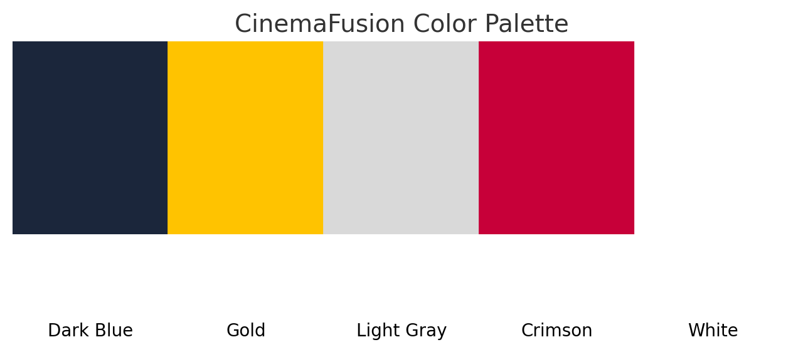
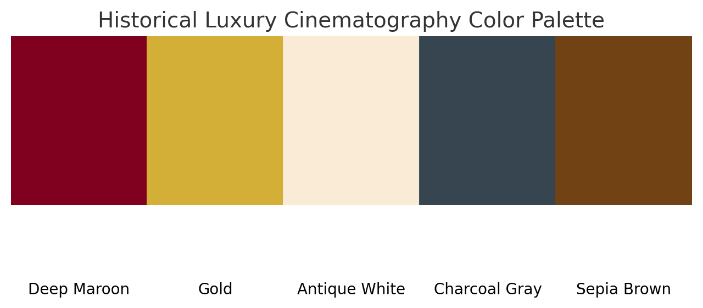
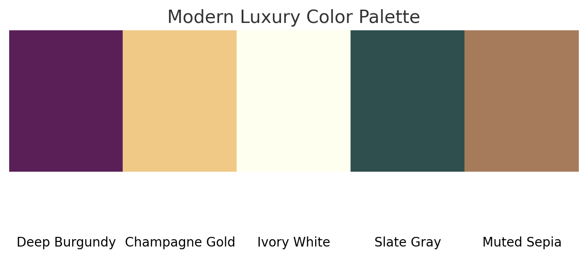

 
<!-- last one will be the best colors -->

```python
import matplotlib.pyplot as plt

# Define the colors and their hex codes
colors = {
    "Deep Burgundy": "#5A1F57",
    "Champagne Gold": "#F0C987",
    "Ivory White": "#FFFFF0",
    "Slate Gray": "#2F4F4F",
}

# Create a figure and axis
fig, ax = plt.subplots(figsize=(8, 2))

# Loop through colors and plot them as rectangles
for i, (name, hex_code) in enumerate(colors.items()):
    ax.add_patch(plt.Rectangle((i, 0), 1, 1, color=hex_code))
    ax.text(i + 0.5, -0.3, name, ha='center', va='center', fontsize=10)

# Set limits and remove axes
ax.set_xlim(0, len(colors))
ax.set_ylim(0, 1)
ax.axis('off')

# Show the plot
plt.tight_layout()
plt.show()


```

--------------
```python
import svgwrite

# Define the colors and their hex codes
colors = {
    "Deep Burgundy": "#5A1F57",
    "Champagne Gold": "#F0C987",
    "Ivory White": "#FFFFF0",
    "Slate Gray": "#2F4F4F",
}

# Create an SVG drawing
svg = svgwrite.Drawing("color_palette.svg", profile="tiny", size=("600px", "150px"))

# Define rectangle dimensions
rect_width = 150
rect_height = 100
x_offset = 10
y_offset = 10
text_offset = 10

# Add rectangles and labels for each color
for i, (name, hex_code) in enumerate(colors.items()):
    x_position = x_offset + i * (rect_width + x_offset)
    svg.add(svg.rect(insert=(x_position, y_offset), size=(rect_width, rect_height), fill=hex_code))
    svg.add(svg.text(
        name,
        insert=(x_position + rect_width / 2, y_offset + rect_height + text_offset),
        text_anchor="middle",
        font_size="12px",
        fill="black"
    ))

# Save the SVG file
svg.save()
print("SVG file 'color_palette.svg' created!")

```